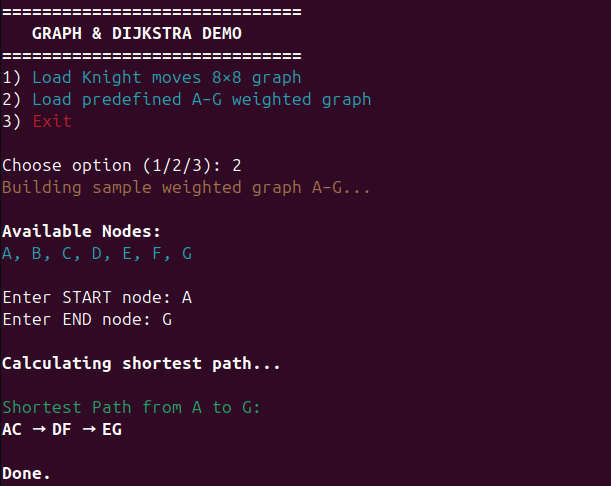
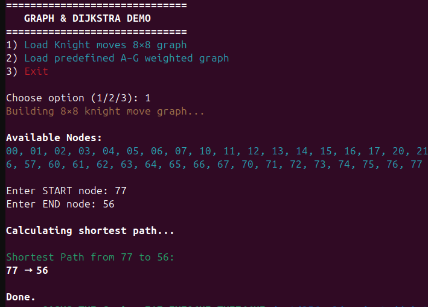

# Working with Data Structures in PHP — Dijkstra’s Algorithm

This project demonstrates how to work with classic **data structures** and **graph algorithms** in PHP.

We start by implementing a **singly linked list**, and then build a **stack** and **queue** on top of it.  
Next, we explore the concept of **graphs**, constructing one using an adjacency matrix.  
Using these classes, we implement **Breadth-First Search (BFS)** and **Depth-First Search (DFS)**.

The final goal of this project is a clear and practical implementation of **Dijkstra’s Algorithm** — used to find the shortest path between nodes in a graph.

---

## 📌 Visual Examples

### **1) Menu & Graph Selection**
Allows choosing between:
- Knight-move graph (8×8 chessboard),
- Predefined weighted graph (A–G).

---

### **2) Graph Structure Preview**

Displays the graph nodes and edges before running any algorithm.

---

### **3) Dijkstra’s Algorithm Output**

Shows the computed shortest path between two nodes.

---